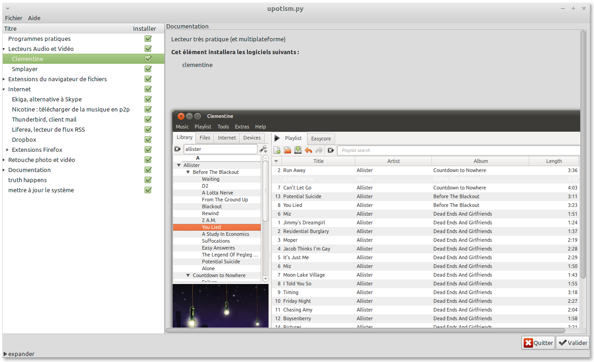

upisi
=====

the Universal Post-Installation Scripts Interface

En développement.

Usage :

- écrire un script bash de post-installation, comme d'habitude, de la forme :
  apt-get install -f foo bar
  echo do something

- utiliser des tags spéciaux en commentaire pour agir sur l'interface graphique Gtk :
  - #+title: un titre
  - #+doc: de la documentation sur l'élément
  - #+sh: titre donné à cette commande shell (une ligne seule est
     interprétée comme une commande shell). Pour regrouper plusieurs
     commandes :
  - #+begin … #+end : toutes les commandes seront exécutées ensemble.

On peut organiser l'interface graphique par catégories :
   `#+cat: Une catégorie
    …
    #+end_cat`

Tout ce qui est dans la catégorie sera regroupé sous une flèche à
dérouler. On peut imbriquer autant de catégorie que l'on veut.

  - #+gui:toggle=False : indique à l'interface de ne pas sélectionner cet élément par défaut.

Le résultat ressemble à:

Télécharger et essayer
==========

Une commande pour télécharger et lancer Upisi : `git clone https://github.com/vindarel/upisi.git && cd upisi/ && python upotism.py`

Pour le dév :
- postinstaller.py : parser du script
- gui.glade : interface graphique Gtk+3 (utiliser glade)
- upotism.py : programme principal
- utils.py : méthodes annexes
- mint-postinstall.sh : exemple complet de script possible
